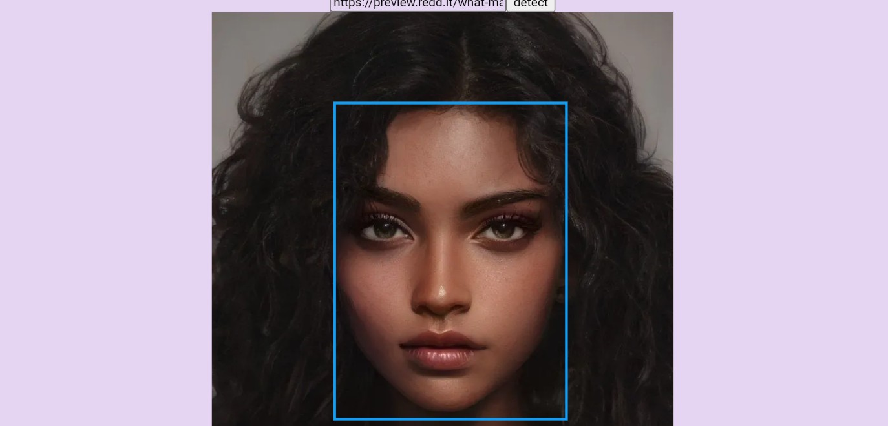

# Face recognition app

This is an AI face recognition app. It utilizes the Clarifai face recognition API to detect faces in your image. 1. Just login or register to access the face detection interface. 2. Paste the link to any image that contains faces and click the detect button to see the app in action .

## Table of contents

- [Overview](#overview)
  - [Screenshot](#screenshot)
  - [The challenge](#the-challenge)
  - [Links](#links)
- [My process](#my-process)
  - [Built with](#built-with)
  - [What I learned](#what-i-learned)
- [Author](#author)

## Overview

### Screenshot



### The challenge

Users should be able to:

- Users should be authenticated (login/register) before they can access the face recognition interface.
- When users paste the link to an image containing faces, the image is displayed on the screen.
- When the detect button is pressed a rectangular boundary appears around each face on the screen.

### Links

- Solution URL: [code here](https://github.com/itksweb/face-detect)
- Live Site URL: [live display](https://face-detectly.vercel.app/)
- API used - [Clarifai](https://clarifai.com)

## My process

I started by fleshing out the Jsx component for authentication, after which I worked on general styling; thereafter, I tested API , fetched data from the same, then I coded the logic.

### Built with

- HTML5 markup
- CSS Flexbox & Grid
- [React](https://reactjs.org/) - JS library
- [Next Js](https://nextjs.org) - JS framework 

### What I learned

I got better at fleshing out and manipulating data fetched from api.

```js
const calculateFaceLocation = (data) => {
  const image = document.getElementById("imgee");
  if (data.length !== 0) {
    let all = [];
    for (const box of data) {
      let data = box.region_info.bounding_box;
      let item = {
        id: box.id,
        box: {
          left: (data.left_col * image.width).toFixed(1) + "px",
          top: (data.top_row * image.height).toFixed(1) + "px",
          right: (image.width - data.right_col * image.width).toFixed(1) + "px",
          bottom:
            (image.height - data.bottom_row * image.height).toFixed(1) + "px",
        },
      };
      all = [...all, item];
    }
    return all;
  }
};
```

## Author

- WhatsApp - [Kingsley Ikpefan](https://wa.me/2348060719978)
- LinkedIn - [here](https://www.linkedin.com/in/kingsleyikpefan)
- Frontend Mentor - [@itksweb](https://www.frontendmentor.io/profile/itksweb)
